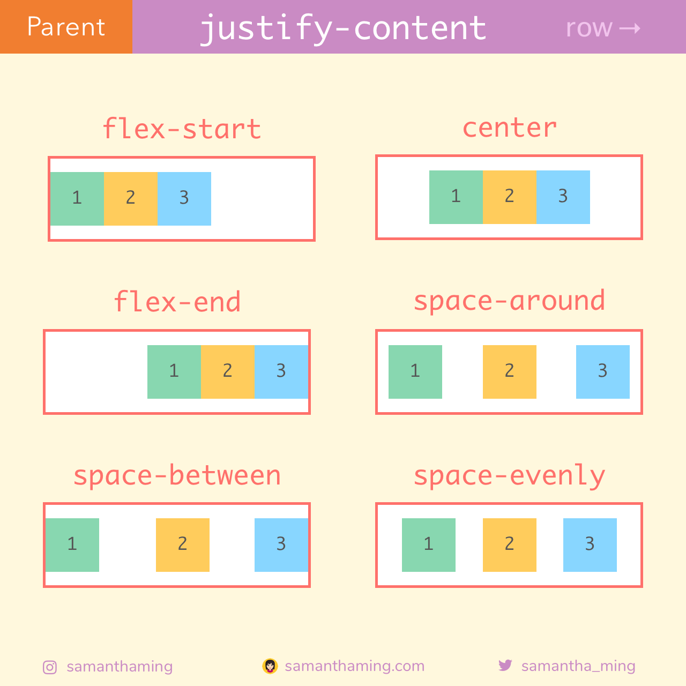

# CSS3 flexbox

## 原典
CSS Flexible Box Layout Module Level 1 : https://www.w3.org/TR/css-flexbox-1/

* block layout, designed for laying out documents
* inline layout, designed for laying out text
* table layout, designed for laying out 2D data in a tabular format
* positioned layout, designed for very explicit positioning without much regard for other elements in the document

CSS2.1 で定義されている上記レイアウトに、新たにフレックスを追加する

## サポート状況

https://caniuse.com/#feat=flexbox

## コンセプト・ポイント

* 縦方向のセンタリング
* 動的なサイズ変更
* 順序のカスタマイズ

## 親コンテナと子コンテナ

* flex コンテナと、flex アイテム
* フレックスコンテナはその直接の子のみをラップする（！）
    * フレックスコンテナは、1層を超えてラップしません。直接の子のみ
    * 子は、その直接の子のコンテナになることができるが、それは完全に別のフレックスボックス。親のプロパティは引き継がれない（！）
    demo: flex_perent_and_child_.html

## フレックスモジュール、メイン軸とクロス軸

 * 縦方向の軸と横方向の軸
 * row が指定されると左から右の横軸がメイン軸になる
 * column が指定されると上から下への縦軸がメイン軸になる
 * それぞれ、開始地点を flex start, 終了地点を flex end という

## ブロック要素とインライン要素

* ブロック要素は要素の幅全体を占有する
* インライン要素は必要な幅のみ占有する

## flex-direction

* デフォルト値は row
* メイン軸を定義する

## flex-wrap

* デフォルト値は no-wrap
> デフォルトのnowrapでは、Flexアイテムは一行に収まるように収縮して配置されます。ただし、Flexアイテムのサイズを維持し、コンテナ内の複数行に配置したい場合は、wrapを使用します。

## flex-flow

* flex-direction と flex-wrap を同時に定義する

##  justify-content

* もっとも利用されているプロパティ。flexbox の核になるプロパティ

ref:https://github.com/samanthaming/Flexbox30

## 参考文献

独学の人でも大丈夫！CSS Flexboxの使い方を基礎から学べるチュートリアル | コリス : https://coliss.com/articles/build-websites/operation/css/learn-flexbox-in-30-days.html

